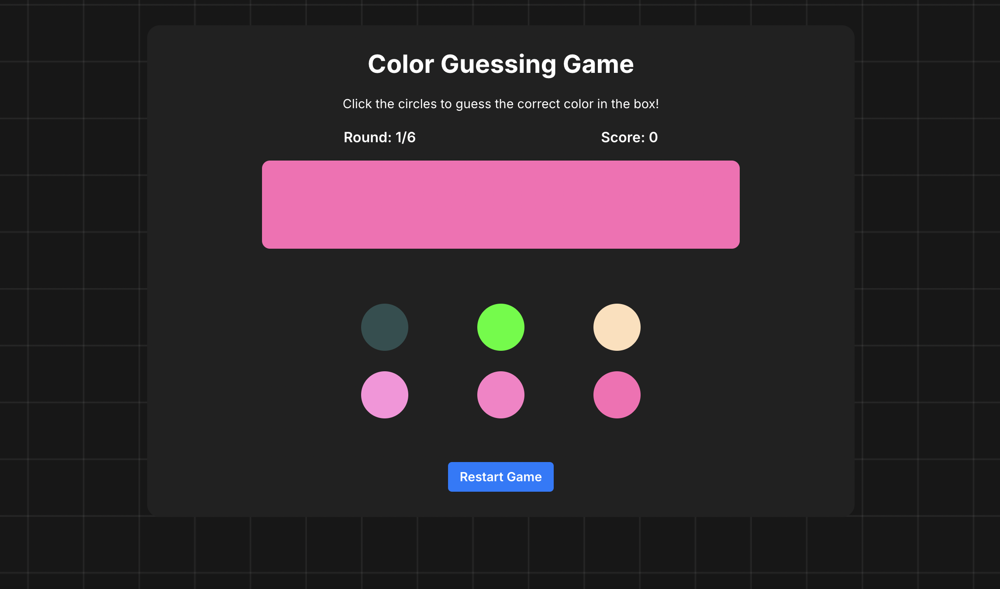

# 🎨 Color Guessing Game

A fun and interactive color guessing game where players try to match a randomly chosen color by selecting from a set of color options. The game consists of 6 rounds, and the player's score is tracked based on correct and incorrect guesses.

## 📸 Screenshot



(Add screenshots of the game here)

### 🚀 Features

🎯 Random Color Selection: The game picks a random color for each round.

🎨 Shades & Contrasting Colors: Generates color options with shades and contrasting colors.

🔢 Score Tracking: Keeps track of wins and losses.

🏆 Game Over Modal: Displays the final score and allows restarting the game.

⏳ Smooth UI Effects: Includes animations for correct and incorrect guesses.

### 🎮 How to Play

- A color is displayed in the color box.

- Choose the correct color from the options below.

- If you guess correctly, you score a win; otherwise, you score a loss.

- The game ends after 6 rounds.

- View your final score and restart the game if desired.

## 📂 Project Structure

```
├── index.html
├── styles.css
├── script.js
├── README.md
```

## 🛠️ Technologies Used

- HTML: Structure of the game

- CSS: Styling and animations

- JavaScript: Game logic and interactivity

## 💡 Future Enhancements

⏳ Timer for each round.

🔊 Sound effects for correct/wrong guesses.

📊 Leaderboard to track high scores.

## 🤝 Contributing

Feel free to fork this repository and make improvements. Pull requests are welcome!

## 📜 License

This project is licensed under the MIT License.

🚀 Enjoy playing the Color Guessing Game! 🎨
